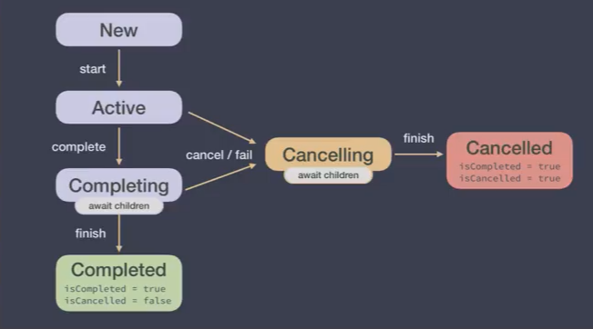
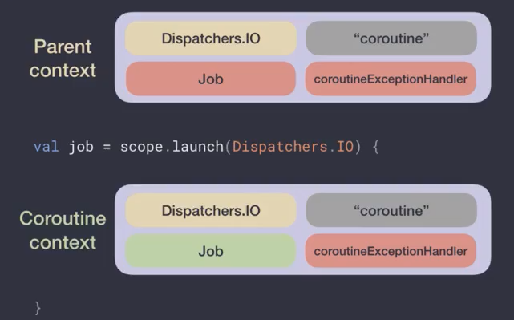
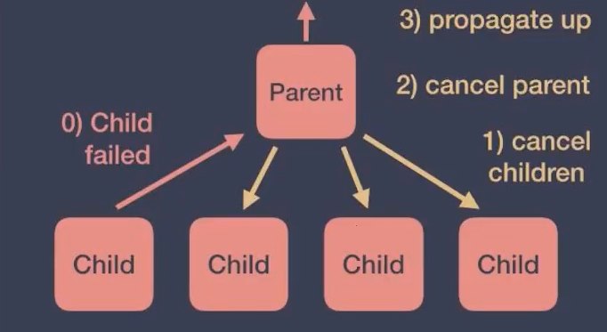
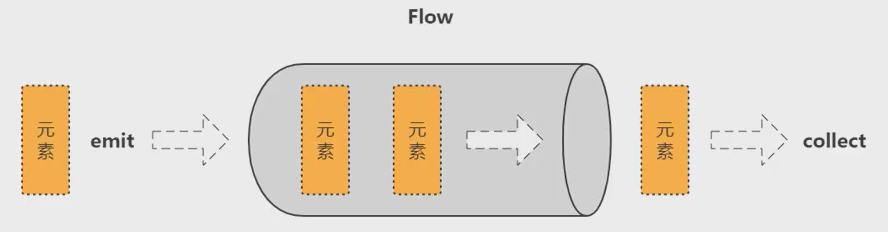
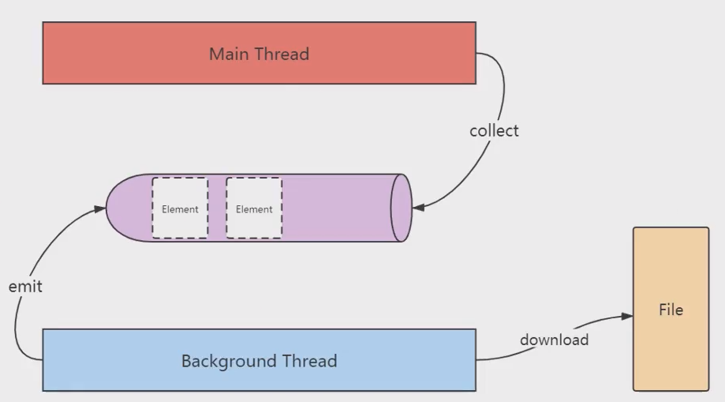
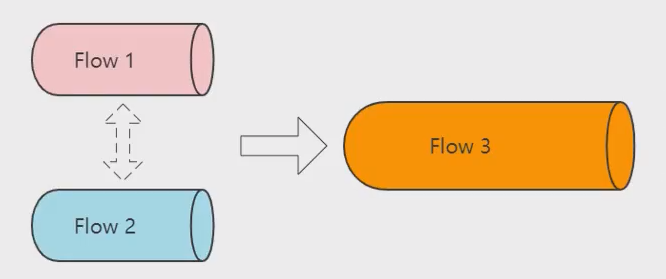

### 1. 异步任务和协程
+ **异步任务**

  后台任务 `doInBackground()` 和  任务完成后的回调 `onPostExecute()`

  ```kotlin
  val submitBtn = findViewById<Button>(R.id.demo01_submitBtn).also {
      it.setOnClickListener {
          object : AsyncTask<Void, Void, List<City>>() {
              // 后台任务
              override fun doInBackground(vararg params: Void?): List<City>? {
                  return userServiceApi.loadUser().execute().body()
              }
              // 回调方法
              override fun onPostExecute(user: List<City>?) {
                  nameTv.text = "id: ${user?.get(0)?.id} => City: ${user?.get(0)?.name}"
              }
          }.execute()
      }
  }
  ```

  + 协程实现

    协程调度器

  ```kotlin
  val submitBtn = findViewById<Button>(R.id.demo01_submitBtn).also {
      it.setOnClickListener {
          GlobalScope.launch(Dispatchers.Main) {
              val user = withContext(Dispatchers.IO) {
                  userServiceApi.getUser()
              }
              nameTv.text = "id: ${user?.get(1)?.id} => City: ${user?.get(1)?.name}"
          }
      }
  }
  ```

  + **协程+挂起函数**
    1. 使用 `suspend`关键字修饰的函数叫作挂起函数；
    2. 挂起函数只能在协程体内或者其他挂起函数内调用；

  ```kotlin
  submitBtn.setOnLongClickListener {
      GlobalScope.launch(Dispatchers.Main) {
          getCities()
      }
      true
  }
  
  private suspend fun getCities() {
      val cities = get()
      show(cities)
  }
  
  private suspend fun get() = withContext(Dispatchers.IO) {
      userServiceApi.getCities()
  }
  
  private fun show(cities: List<City>) {
      nameTv.text = "id: ${cities?.get(2)?.id} => City: ${cities?.get(2)?.name}"
  }
  ```

### 2. 基础概念

+ **协程是什么？**

  协程基于线程，它是轻量级线程。

  1. 协程让==异步逻辑同步化==，杜绝回调地狱；
  2. 协程最核心的点就是，函数或者一段程序能够被==挂起==，稍后再在挂起的位==恢复==。

+ **协程用来解决什么问题？**

  1. 处理耗时任务，这种任务常常会阻塞主线程；
  2. 保证主线程安全，即确保安全地从主线程调用任何suspend函数。


  + **协程的挂起和恢复**
  
    常规函数基础操作包括：invoke（或call）和return，协程新增了suspend和resume：
  
    ==suspend==：也称为挂起或暂停，用于暂停执行当前协程，并保存所有局部变量；
    
    ==resume==：用于让已暂停的协程从其暂停处继续执行。
    
    使用suspend关键字修饰的函数叫作挂起函数；
    
    挂起函数只能在协程体内或其他挂起函数内调用。
    
  + **调度器**

    所有协程必须在调度器中运行，即使它们在主线程上运行也是如此。

    

  + **协程的两部分**

    ==基础设施层==： 标准库的协程API，主要对协程提供了概念和语义上最基本的支持；

    ==业务框架层==： 协程的上层框架支持

+ **协程的任务泄漏**

  当某个协程任务丢失，无法追踪，会导致内存、CPU、磁盘等资源浪费，甚至发送一个无用的网络请求，这种情况称为==任务泄漏==。

  为了能够避免协程泄漏，Kotlin引入了==结构化并发机制==。

+ **结构化并发**

  使用结构化并发可以做到：

  1. 取消任务，当某项任务不再需要时取消它；
  2. 追踪任务，当任务正在执行是，追踪它；
  3. 发出错误信号，当协程失败时，发出错误信号表明有错误发生。

+ **CoroutineScope**

  定义协程必须指定其CoroutineScope，它会跟踪所有协程，同样它还可以取消由它所启动的所有协程。

  常用的相关API有：

  1. ==GlobalScope==：生命周期是process级别的，即使Activity或Fragment已经被销毁，协程仍然在执行；
  2. ==MainScope==：在Activity中使用，可以在onDestroy0中取消协程；
  3. ==viewModelScope==：只能在ViewModel中使用，绑定ViewModel的生命周期；
  4. ==lifecycleScope==：只能在Activity、Fragment中使用，会绑定Activity和Fragment的生命周期。

### 3. 协程的启动与取消

#### 3.1 **协程构建器**

+ **launch与async构建器都用来启动新协程**

  ==launch==：返回一个Job并且不附带任何结果值；

  ==async==：返回一个Deferred，Deferred也是一个Job，可以使用.await()在一个延期的值上得到它的最终结果。

+ **等待一个作业**

  join与await
  组合并发

#### 3.2 协程的启动模式

==DEFAUlT==：协程创建后，立即开始调度，在调度前如果协程被取消，其将直接进入取消响应的状态；

==ATOMIC==：协程创建后，立即开始调度，协程执行到第一个挂起点之前不响应取消；

==LAZY==：只有协程被需要时，包括主动调用协程的`start`、`join`或者`await`等函数时才会开始调度，如果调度前就被取消，那么该协程将直接进入异常结束状态；

==UNDISPATCHED==：协程创建后立即在当前函数调用栈中执行，直到遇到第一个真正挂起的点。

#### 3.3 协程的作用域构建器

+ **coroutineScope与runBlocking**

  `runBlocking`是常规函数，而``coroutineScope`是挂起函数；

  它们==都会等待其协程体以及所有子协程结束==，主要区别在于`runBlocking`方法会阻塞当前线程来等待，而`coroutineScope`只是挂起，会释放底层线程用于其他用途。

+ **coroutineScope与supervisorScope**

  coroutineScope：一个协程失败了，所有其他兄弟协程也会被取消；

  supervisorScope：一个协程失败了，不会影响其他兄弟协程。

#### 3.4 Job对象

对于每一个创建的协程（通过launch或者async），会返回一个Job实例，该实例是协程的唯一标示，并且负责管理协程的生命周期。

一个任务可以包含一系列状态：新创建（==New==）、活跃（==Active==）、完成中（==Completing==）、已完成（==Completed==）、取消中（==Cancelling==）和已取消（==Cancelled==）。虽然我们无法直接访问这些状态，但是我们可以访问`job`的属性：`isActive`、`isCancelled`和`isCompleted`。

+ **Job的生命周期**

  如果协程处于活跃状态，协程运行出错或者调用`job.cancel()`都会将当前任务置为取消中（Cancelling）状态（`isActive=false,isCancelled=true`）。当所有的子协程都完成后，协程会进入已取消（Cancelled）状态，此时`isCompleted=true`。

  

+ **coroutineScope与CoroutineScope**

  `coroutineScope(){...}`协程的作用域构建器，会继承父协程的作用域，会等待其协程体以及所有子协程结束。

  `val scope=CoroutineScope(Dispatchers.Default)`自定义协程作用域，不会继承父协程的作用域，能通过scope取消协程。

#### 3.5 协程的取消

1. 取消作用域会取消它的子协程；
2. 被取消的子协程并不会影响其余兄弟协程；
3. 协程通过抛出一个特殊的异常`CancellationException`来处理取消操作；
4. 所有`kotlinx.coroutines`中的挂起函数（`withContext`、`delay`等）都是可取消的。	

+ **CPU密集型任务取消**
  1.  `isActive`：是一个可以被使用在CoroutineScope中的扩展属性，检查Job是否处于活跃状态；
  1.  `ensureActive()` 如果job处于非活跃状态，这个方法会立即抛出异常，异常会静默掉，需要try-catch捕获；
  1.  `yield`函数会检查所在协程的状态，如果已经取消，则抛出`CancellationException`予以响应。此外，它还会尝试出让线程的执行权，给其他协程提供执行机会。
+ **协程取消的副作用**
  1. 在finally中释放资源；
  2. ==use()==函数：该函数只能被实现了`Closeable`的对象使用，程序结束的时候会自动调用`close`方法，适合文件对象。
+ **不能取消的任务**
  1. 处于取消中状态的协程不能够挂起（运行不能取消的代码），当协程被取消后需要调用挂起函数，我们需要将清理任务的代码放置于NonCancellable CoroutineContext中。
  2. 这样会挂起运行中的代码，并保持协程的取消中状态直到任务处理完成。
+ **超时任务**
  1. 很多情况下取消一个协程的理由是它有可能超时；
  2. `withTimeoutOrNull`通过返回`null`来进行超时操作，从而替代抛出一个异常。

### 4. 协程上下文

+ **协程的上下文是什么？**

  `CoroutineContext`是一组用于定义协程行为的元素。它由如下几项构成：

  1. ==Job==：控制协程的生命周期；
  2. ==CoroutineDispatcher==：向合适的线程分发任务；
  3. ==CoroutineName==：协程的名称，调试的时候很有用；
  4. ==CoroutineExceptionHandler==：处理未被捕捉的异常。

+ **组合上下文中的元素**

  有时我们需要在协程上下文中定义多个元素。我们可以使用+操作符来实现。比如说，我们可以显式指定一个调度器来启动协程并且同时显式指定一个命名：

  ```kotlin
  @Test
  fun `test CoroutineContext`() = runBlocking<Unit> {
      launch(Dispatchers.Default + CoroutineName("C3Name")) {
          println("I'm working in thread ${Thread.currentThread().name}")
      }
  }
  ```

+ **协程上下文的继承**

  对于新创建的协程，它的 `CoroutineContext` 会包含一个全新的Job实例，它会帮助我们控制协程的生命周期。而==剩下的元素会从`CoroutineContext`的父类继承==，该父类可能是另外一个协程或者创建该协程的CoroutineScope。

  ```kotlin
  @Test
  fun `test CoroutineContext extend`() = runBlocking {
      val scope = CoroutineScope(Job() + Dispatchers.IO + CoroutineName("C3Name"))
      val job = scope.launch {
          println("${coroutineContext[Job]}~${Thread.currentThread().name}")
          val result = async {
              println("${coroutineContext[Job]}~${Thread.currentThread().name}")
              "OK"
          }.await()
      }
      job.join()
  }
  ```

  ==协程的上下文 = 默认值 + 继承的CoroutineContext + 参数==
  
  1. 一些元素包含默认值：`Dispatchers.Default`是默认的`CoroutineDispatcher`，以及"coroutine"作为默认的`CoroutineName`；
  2. 继承的`CoroutineContext`是`CoroutineScope`或者其父协程的`CoroutineContext`；
  3. 传入协程构建器的参数的优先级高于继承的上下文参数，因此会覆盖对应的参数值。
  
  ```kotlin
  @Test
  fun `test CoroutineContext extend2`() = runBlocking {
      val coroutineExceptionHandler = CoroutineExceptionHandler { _, exception ->
          println("Caught $exception")
      }
      val scope = CoroutineScope(
          Job() + Dispatchers.Main + coroutineExceptionHandler
      )
      // 新的CoroutineContext = 父级CoroutineContext + Job()
      val job = scope.launch(Dispatchers.IO) {
          // 新协程
      }
  }
  ```
  
  最终的父级`CoroutineContext`会内含`Dispatchers.IO`而不是`scope`对象里的`Dispatchers.Main`，因为它被协程的构建器里的参数覆盖了。此外，注意一下父级`CoroutineContext`里的`Job`是`scope`对象的`Job`（红色），而新的`Job`实例（绿色）会赋值给新的协程的`CoroutineContext`。
  
  

### 5. 协程的异常处理

+ **异常处理的必要性**

  当应用出现一些意外情况时，给用户提供合适的体验非常重要，一方面，目睹应用崩溃是个很糟糕的体验，另一方面，在用户操作失败时，也必须要能给出正确的提示信息。

#### 5.1 异常的传播

协程构建器有两种形式：==自动传播异常==（`launch`与`actor`），==向用户暴露异常==（`async`与`produce`）当这些构建器用于创建一个==根协程==时（该协程不是另一个协程的子协程），前者这类构建器，异常会在它发生的第一时间被抛出，而后者则依赖用户来最终消费异常，例如通过`await`或`receive`。

+ **非根协程的异常**

  其他协程所创建的协程中，产生的异常总是会被传播。

  ```kotlin
  @Test
  fun `test exception propagation2`() = runBlocking<Unit> {
      val scope = CoroutineScope(Job())
      val job = scope.launch {
        // 非根协程异常直接抛出
        async {
              throw IllegalArgumentException()
          }
      }
      job.join()
  }
  ```

+ **异常的传播特性**

  当一个协程由于一个异常而运行失败时，它会传播这个异常并传递给它的父级。接下来，父级会进行下面几步操作：

  1. 取消它自己的子级；
  2. 取消它自己；
  3. 将异常传播并传递给它的父级。

  

#### 5.2 SupervisorJob

使用`SupervisorJob`时，一个子协程的运行失败不会影响到其他子协程。`SupervisorJob`不会传播异常给它的父级，它会==让子协程自己处理异常==。

这种需求常见于在作用域内定义作业的UI组件，如果任何一个UI的子作业执行失败了，它并不总是有必要取消整个UI组件，但是如果UI组件被销毁了，由于它的结果不再被需要了，它就有必要使所有的子作业执行失败。

#### 5.3 异常的捕获

使用==`CoroutineExceptionHandler`==对协程的异常进行捕获。

以下的条件被满足时，异常就会被捕获：

1. ==时机==：异常是被自动抛出异常的协程所抛出的（使用launch，而不是async时）；
2. ==位置==：在`CoroutineScope`的`CoroutineContext`中或在一个根协程（`CoroutineScope`或者`supervisorScope`的直接子协程）中.

+ **Android中全局异常处理**

  全局异常处理器可以获取到所有协程未处理的未捕获异常，不过它并不能对异常进行捕获，虽然==不能阻止程序崩溃==，全局异常处理器在程序调试和异常上报等场景中仍然有非常大的用处。

  我们需要在`classpath`下面创建`META-INF/services`目录，并在其中创建一个名为`kotlinx.coroutines.CoroutineExceptionHandler`的文件，文件内容就是我们的全局异常处理器的全类名。

#### 5.4 取消异常

1. 取消与异常紧密相关，协程内部使`CancellationException`来进行取消，这个异常会被忽略；
2. 当子协程被取消时，不会取消它的父协程；
3. 如果一个协程遇到了`CancellationException`以外的异常，它将使该异常取消它的父协程。当父协程的所有子协程都结束后，异常才会被父协程处理。

#### 5.5 异常的聚合

当协程的多个子协程因为异常而失败时，一般情况下取第一个异常进行处理。在第一个异常之后发生的所有其他异常，都将被==绑定到第一个异常之上==。

### 6. 异步流Flow

#### 6.1 认识Flow

+ **如何表示多个值？**

  挂起函数可以异步的返回单个值，但是该如何异步返回多个计算好的值呢？

+ **异步返回多个值的方案**

  1. 集合
  2. 序列
  3. 挂起函数
  4. Flow

+ **FIow与其他方式的区别**

  1. 名为`flow`的`Flow`类型构建器函数；
  2. `flow{...}`构建块中的代码可以挂起；
  3. 函数`simpleFlow`不再标有`suspend`修饰符；
  4. 流使用`emit`函数发射值；
  5. 流使用`collect`函数收集值。

  

+ **Flow应用**

  在Android当中，文件下载是`Flow`的一个非常典型的应用。

  

+ **冷流**

  `Flow`是一种类似于序列的冷流，`flow`构建器中的代码直到流被收集的时候才运行。

+ **流的连续性**

  流的每次单独收集都是**按顺序**执行的，除非使用特殊操作符。

  从上游到下游每个过渡操作符都会处理每个发射出的值，然后再交给末端操作符。

+ **流构建器**

  `flowOf`构建器定义了一个发射固定值集的流；

  使用`.asFlow()`扩展函数，可以将各种集合与序列转换为流。

+ **流上下文**

  流的收集总是在调用协程的上下文中发生，流的该属性称为==上下文保存==；

  `flow{...}`构建器中的代码必须遵循上下文保存属性，并且不允许从其他上下文中发射（emit）；

  ==flowOn操作符==，该函数用于更改流发射的上下文。

+ **启动流**

  使用`launchIn`替换`collect`我们可以在单独的协程中启动流的收集。

+ **流的取消**

  流采用与协程同样的协作取消。像往常一样，流的收集可以是当流在一个可取消的挂起函数（例如`delay`）中挂起的时候取消。

+ **流的取消检测**

  为方便起见，流构建器对每个发射值执行附加的`ensureActive`检测以进行取消，这意味着从`flow{...}`发出的繁忙循环是可以取消的。

  出于性能原因，大多数其他流操作不会自行执行其他取消检测，在协程处于繁忙循环的情况下，必须明确检测是否取消。

  通过`cancellable`操作符来执行此操作。

+ **背压**

  1. `buffer()`，缓存收到的数据，并发运行流中发射元素的代码；
  2. `conflate()`，合并发射项，不对每个值进行处理；
  3. `collectLatest()`，取消并重新发射最后一个值；
  4. 当必须更改`CoroutineDispatcher`时，`flowOn`操作符使用了相同的缓冲机制，但是`buffer()`函数显式地请求缓冲而==不改变执行上下文==。

#### 6.2 Flow操作符

+ **过渡流操作符**

  1. 可以使用操作符转换流，就像使用集合与序列一样；
  2. 过渡操作符应用于上游流，并返回下游流；
  3. 这些操作符也是冷操作符，就像流一样。这类操作符本身不是挂起函数；
  4. 它运行的速度很快，返回新的转换流的定义。
  5.  `map`、`transform`、`filter`、`take`等

+ **末端流操作符**

  1. 末端操作符是在流上用于==启动流收集的挂起函数==，`collect`是最基础的末端操作符，但是还有另外一些更方便使用的末端操作符；
  2. 转化为各种集合，例如`toList`与`toSet`；
  3. 获取第一个`first`值与确保流发射单个`single`值的操作符；
  4. 使用`reduce`与`fold`将流规约到单个值。

+ **组合多个流**

  就像Kotlin标准库中的`Sequence.zip`扩展函数一样，流拥有一个`zip`操作符用于组合两个流中的相关值。

+ **展平流**

  流表示异步接收的值序列，所以很容易遇到这样的情况：每个值都会触发对另一个值序列的请求，然而，由于流具有异步的性质，因此需要不同的展平模式，为此，存在一系列的流展平操作符：

  1. `flatMapConcat`连接模式；
  2. `flatMapMerge`合并模式；
  3. `flatMapLatest`最新展平模式。

  


#### 6.3 Flow异常

